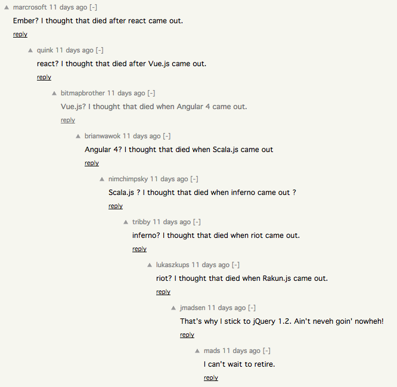
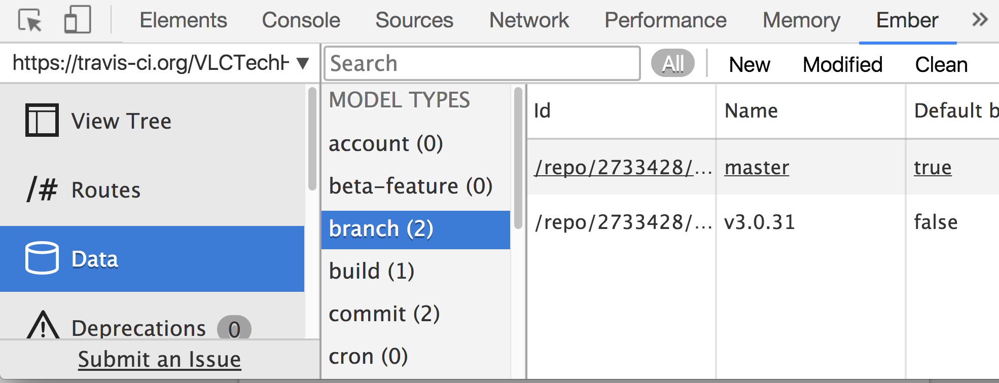
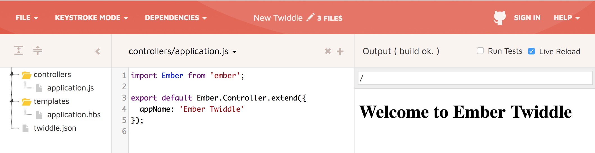
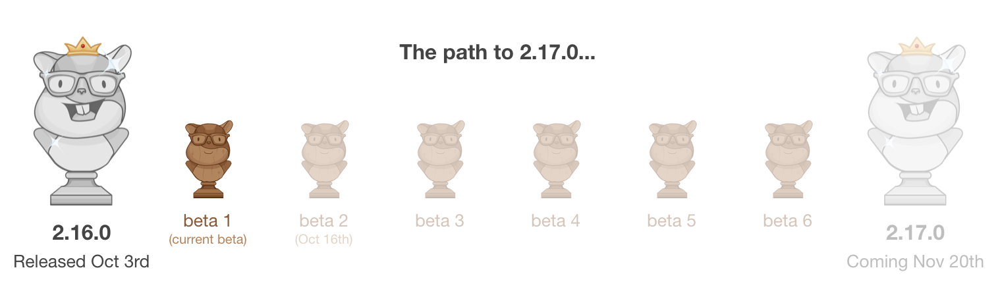
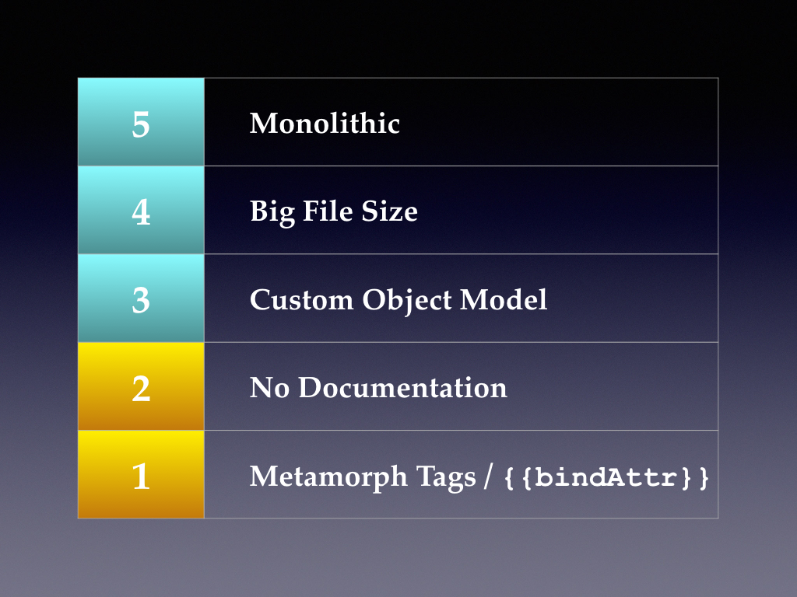

# Me casé con <span class="gold">EmberJS</span>
#### y no vas a creer que pasó a continuación

---



---

## ~~Consejos~~ Dudas matrimoniales

---

###### Dudas matrimoniales

> Voy a tener que añadir funcionalidad a un ritmo sostenible, ¿cómo de bien esta orientado a test?

---

###### Dudas matrimoniales

> Puede que mi equipo crezca, ¿qué documentación y guías hay? 

---

###### Dudas matrimoniales

> ¿Cuanta burocracia conlleva? ¿Tiene integrado tooling para deploy, test runners, builds por entorno, asset fingerprinting...?

---

###### Dudas matrimoniales

> Voy a tener que mantener este producto durante un tiempo, ¿qué release plan tiene? ¿Cómo de fácil es actualizar versiones? ¿Durante cuanto tiempo se mantienen?

---

###### Dudas matrimoniales

 > ¿Quién mantiene el framework? ¿Cómo evoluciona? ¿Quién decide las nuevas funcionalidades? ¿Hay alguna compañía detrás o es mantenido por una comunidad?

---

## Conociendo al novio: EmberJS en un pispás

 - Aquí quien manda es la url
 - Página = Route + template
 - Y quien sirve los datos?
 - Componentes, componentes *everywhere*

---

## ¿Cómo es estar casad@ con EmberJS?

---

Te permite estar <span class="gold">enfocad@ en desarrollar</span> y publicar nuevas características en tu producto.

Para ello te brinda un rico ecosistema de **tooling, testing, addons y documentación**

---

### Tooling

 1. ember-cli
 2. inspector de navegador
 3. ember-twiddle

---

### Tooling

 1. <span class="gold">ember-cli</span>
 2. inspector de navegador
 3. ember-twiddle

---

###### <span class="gold">ember-cli</span>

```
 npm install -g ember-cli 
```

Utilidad de linea de comandos basada en Broccoli, babel, ~~npm y bower~~, yarn

---

###### <span class="gold">ember-cli</span>

```shell
> ember new jsday
```

Crea nuevos proyectos sin preocuparte de su estructura

--- 

###### <span class="gold">ember-cli</span>

```shell
|-app
|-config
|-node_modules
|-public
|-tests
|-vendor
ember-cli-build.js
package.json
README.md
testem.js
```

@[1](La mayor parte del código caerá aquí: modelos, rutas, componentes...)
@[2](Configuración del proyecto: rutas base para apis, flags, etc)
@[4](Carpeta para assets públicos: imagenes y fuentes)
@[5](Tests para los modelos, rutas, componentes...)
@[6](Carpeta para librerías de terceros no gestionadas)
@[7](Configura como se construye el proyecto)

---

###### <span class="gold">ember-cli</span>

```shell
> ember generate route contact-us

installing route
  create app/contact-us/route.js
  create app/contact-us/template.hbs
updating router
  add route contact-us
installing route-test
  create tests/unit/contact-us/route-test.js
```

<span class="aside">**Generadores**: usa los generadores _built-in_ para seguir las prácticas más actuales (y sus correspondientes tests) </span>

---

###### <span class="gold">ember-cli</span>

```shell
> ember serve
> ember build
> ember build --environment="production"
```

<span class="aside">Construcción del proyecto: compilación de assets, finger-printing y gestión del pipeline de deploy</span>

---

###### <span class="gold">ember-cli</span>

```shell
> ember build --environment="production"

cleaning up...
Built project successfully. Stored in "dist/".
File sizes:
 - dist/assets/jsday-af67185.js: 5.38 KB (1.39 KB gzipped)
 - dist/assets/jsday-d41d8cd.css: 0 B
 - dist/assets/vendor-d41d8c.css: 0 B
 - dist/assets/vendor-fd395a.js: 737.24 KB (191.02 KB gzipped)
```

---

### Tooling

 1. ember-cli
 2. <span class="gold">inspector de navegador</span>
 3. ember-twiddle

---

###### <span class="gold">inspector de datos</span>



<span class="aside"> Para Chrome y Firefox</span>

---

### Tooling

 1. ember-cli
 2. inspector de navegador
 3. <span class="gold">ember-twiddle</span>

---

###### <span class="gold">ember-twiddle</span>



<span class="aside">ember-twiddle.com</span>

---

### Testing

> Testing is a core part of the Ember framework and its development cycle.

---

### Testing

```shell
> ember test
> ember test --serve --launch=Chrome
```

<span class="aside">Basado en [testem.js](https://github.com/testem/testem), corre con [phantomjs](http://phantomjs.org/) o headless chrome, por defecto usa [qunit](https://qunitjs.com/) pero es fácil pasarse a [mocha](https://github.com/emberjs/ember-mocha)</span>

---

### Testing

##### Tests unitarios

```javascript
describe('Collaborators > fround', function() {
  it('rounds a number to its 4th decimal', function() {
    expect(fround(0.1).toString()).to.eql("0.1");
    expect(fround(0.12).toString()).to.eql("0.12");
    expect(fround(0.123).toString()).to.eql("0.123");
    expect(fround(0.1234).toString()).to.eql("0.1234");
    expect(fround(0.12345).toString()).to.eql("0.1235");
  });

  it('two rounded numbers are the same', function() {
    expect(0.1 + 0.2).to.not.eql(0.3);
    expect(fround(0.1 + 0.2)).to.eql(fround(0.3));
  });
});
```
<span class="aside"> Objetos que no tienen representacion html: modelos, servicios, rutas, utils...</span> 

---

### Testing

##### Tests de integración

```javascript
describe('Integration > Component > ag-toaster', function() {
  setupComponentTest('ag-toaster', {
    integration: true
  });

  it('renders an ag-alert success message', function() {
    this.set('messages', [{ type: 'success', message: 'foobar' }]);
    this.render(hbs`{{ag-toaster
      messages=messages
    }}`);
    expect(this.$('.alert')).to.have.length(1);
    expect(this.$('.alert').text()).to.include('foobar');
  });
});
```
<span class="aside">Para componentes, se mockean los datos y servicios</span> 

---

### Testing

##### Tests de aceptación

```javascript
it('creates a new warehouse', function() {
    visit('/configuration/warehouses/new');
    fillIn('.form input[data-test-name="name"]', 'anything');
    click('.form .button.-confirm');
    andThen(function() {
      expect(currentPath()).to.equal('configuration.warehouses.index');
    });
  });
```
<span class="aside">Son los más lentos: levantan toda la aplicación, se mockean las llamadas ajax</span> 

---

### Addons

```shell
> ember install ember-intl 
```

<span class="aside">Algunos de los addons que usamos son: ember-data, ember-intl, ember-cp-validations, ember-cli-sass, ember-leaflet, ember-light-table, ember-cli-eslint </span>

---

## Documentación

> emberjs.com

<span class="aside"> Documentación de la API, aplicación de ejemplo y extenso apartado para modelos, rutas, templates, componentes y testeo</span> 

---

> embercommunity.slack.com

- ~10k usuarios
- #announcements, #help, #jobs
- #ember-cli, #ember-data, #e-leaftle, #e-light-table

---

## Documentación

> twiddle.com

---

## ¿Qué hay de nuevo, viejo?

---

###### Ciclo de release



<span class="aside">Versioneado semantico, nueva version cada 6 semanas, betas dispoibles, LTS cada 4 releases</span>

---

###### Y yo como me entero?

 - Canal #announcements
 - Blog posts con deprecations de la versión actual y la beta
 - Se deja tiempo al desarrollador para resolver las deprecations hasta la siguiente version mayor

 <span class="aside">Ejemplo: https://emberjs.com/blog/2017/09/01/ember-2-15-released.html</span>

--- 

###### Hacia donde vamos

> https://github.com/emberjs/rfcs
  
  Mantenido por la comunidad

<span class="aside"> Ejemplo: https://github.com/emberjs/rfcs/pull/252 </span>

---

## Recapitulando...

- Curva de aprendizaje: estandarización, documentación y ayuda
- Añadiendo funcionalidad: addons
- Puesta en producción: Tooling del proyecto
- Mantenimiento: tests y actualizaciones

---

## ¿Cómo es estar casad@ con EmberJS?

---

## Q & A

---



---


---
